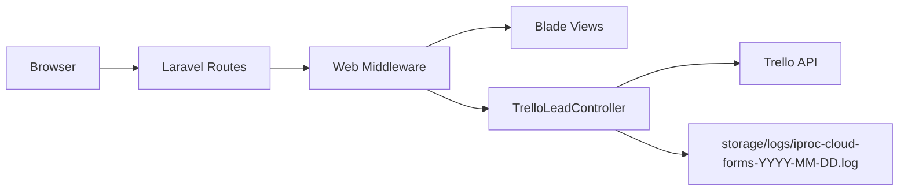

# iProc Landing App

Website public untuk ekosistem iProc yang berfungsi sebagai landing page utama, halaman produk `iProc Cloud`, halaman produk `iProc 2Go`, halaman kebijakan privasi, serta endpoint lead form yang terintegrasi ke Trello.

Dokumentasi tambahan:

- [Arsitektur Aplikasi](docs/ARCHITECTURE.md)
- [Panduan Deployment](docs/DEPLOYMENT.md)

## Ringkasan

Project ini dibangun menggunakan Laravel 13 sebagai backend web server dan Blade sebagai template engine. Sebagian besar halaman bersifat content-driven dan dirender di server, sementara interaktivitas frontend ditangani oleh JavaScript ringan dan asset statis.

Fitur utama:

- Landing page bilingual untuk homepage dan halaman produk
- Routing bahasa default `en` dan prefix `/id` untuk Bahasa Indonesia
- Integrasi lead form `iProc Cloud` ke Trello
- Logging khusus untuk submission form
- Asset pipeline berbasis Vite dan Tailwind CSS v4

## Tech Stack

| Layer | Teknologi |
| --- | --- |
| Backend | PHP 8.3+, Laravel 13 |
| Templating | Blade |
| Frontend build | Vite 8 |
| CSS | Tailwind CSS 4 |
| HTTP client | Laravel HTTP Client |
| Integrasi eksternal | Trello API |
| Database default | SQLite |
| Logging | Laravel Logging, daily file log |
| Utility frontend | jQuery, Flowbite, AOS, Tiny Slider |

## Arsitektur Singkat

Secara umum aplikasi ini mengikuti pola server-rendered web app:

1. Request masuk ke Laravel.
2. Middleware `SetLocale` menentukan locale berdasarkan URL.
3. Middleware `ApplyTranslations` menerapkan translasi berbasis atribut `data-i18n`.
4. Route mengarahkan request ke Blade view statis atau ke `TrelloLeadController`.
5. Untuk lead form, controller melakukan validasi, logging, lalu mengirim data ke Trello.

Alur sederhananya:



Penjelasan detail tersedia di [docs/ARCHITECTURE.md](docs/ARCHITECTURE.md).

## Struktur Direktori

```text
app/
  Http/
    Controllers/
    Middleware/
bootstrap/
config/
database/
docs/
lang/
public/
  lib/
resources/
  css/
  js/
  views/
routes/
storage/
tests/
```

Direktori yang paling sering disentuh:

- `routes/web.php`: definisi route public dan endpoint API form
- `resources/views/pages`: entry page Blade
- `resources/views/partials`: section per halaman
- `lang/en` dan `lang/id`: kamus translasi
- `app/Http/Controllers/TrelloLeadController.php`: integrasi form ke Trello
- `config/services.php`: konfigurasi kredensial Trello
- `config/logging.php`: channel log untuk submission form

## Halaman dan Endpoint

| URL | Fungsi |
| --- | --- |
| `/` | Homepage |
| `/iproc-cloud` | Landing page iProc Cloud |
| `/iproc-cloud/form-success` | Halaman sukses submit form |
| `/iproc-2go` | Landing page iProc 2Go |
| `/iproc-2go/privacy-policy` | Privacy policy iProc 2Go |
| `/id/...` | Versi Bahasa Indonesia dari halaman public |
| `/api/trello_card.php` | Endpoint submit lead ke Trello |
| `/up` | Health check Laravel |

## Kebutuhan Environment

Minimal environment yang dibutuhkan:

- PHP `^8.3`
- Composer 2.x
- Node.js 20+
- NPM 10+
- Ekstensi PHP standar Laravel
- Web server Apache atau Nginx

Environment variable penting:

```env
APP_ENV=local
APP_DEBUG=false
APP_URL=http://localhost
APP_KEY=

SESSION_DRIVER=file
CACHE_STORE=file
QUEUE_CONNECTION=sync

LOG_CHANNEL=stderr
LOG_LEVEL=info

TRELLO_LEAD_KEY=
TRELLO_LEAD_TOKEN=
TRELLO_LEAD_LIST=
```

Catatan:

- Integrasi form Trello tidak akan berfungsi tanpa `TRELLO_LEAD_KEY`, `TRELLO_LEAD_TOKEN`, dan `TRELLO_LEAD_LIST`.
- Secara default project ini dapat berjalan dengan SQLite.
- Saat ini core aplikasi tidak memiliki tabel bisnis khusus selain migration bawaan Laravel.

## Setup Lokal

1. Install dependency backend.

```bash
composer install
```

2. Siapkan environment file.

```bash
cp .env.example .env
php artisan key:generate
```

3. Siapkan database.

```bash
php artisan migrate
```

4. Install dependency frontend.

```bash
npm install
```

5. Jalankan aplikasi.

```bash
composer run dev
```

Command di atas akan menjalankan:

- Laravel development server
- Queue listener
- Log tailing
- Vite dev server

Alternatif cepat:

```bash
php artisan serve
npm run dev
```

## Build Production

```bash
composer install --no-dev --optimize-autoloader
npm ci
npm run build
php artisan config:cache
php artisan route:cache
php artisan view:cache
```

Hasil build frontend akan berada di `public/build`.

## Deployment

Ringkasan langkah deployment:

1. Clone project ke server.
2. Install dependency Composer tanpa dev dependency.
3. Install dependency Node lalu build asset.
4. Siapkan `.env` production dan isi kredensial Trello.
5. Jalankan migration.
6. Set document root ke folder `public`.
7. Pastikan permission `storage` dan `bootstrap/cache` benar.
8. Cache konfigurasi Laravel.

Panduan lengkap tersedia di [docs/DEPLOYMENT.md](docs/DEPLOYMENT.md).

## Logging dan Monitoring

Log utama aplikasi mengikuti `LOG_CHANNEL`.

Khusus lead form `iProc Cloud`, aplikasi menulis log harian ke:

- `storage/logs/iproc-cloud-forms-YYYY-MM-DD.log`

Log ini mencakup:

- payload submission yang sudah dinormalisasi
- metadata request
- status sukses atau gagal kirim ke Trello
- error validasi dan warning custom field

## Testing

Menjalankan test:

```bash
php artisan test
```

## Catatan Operasional

- Endpoint `/api/trello_card.php` menerima `POST` dan `OPTIONS`, serta dibebaskan dari CSRF karena dipakai sebagai endpoint form.
- Controller menggunakan honeypot field untuk mengurangi spam.
- Header CORS pada endpoint lead saat ini bersifat wildcard (`*`), sehingga perlu ditinjau ulang bila deployment dilakukan di environment dengan pembatasan origin yang ketat.

## Next Improvement

Beberapa pengembangan yang masuk akal untuk fase berikutnya:

- Menambahkan CI/CD pipeline
- Menambahkan dokumentasi environment per stage
- Membatasi origin CORS untuk endpoint form
- Menambahkan observability yang lebih terstruktur
- Menyelesaikan CMS sederhana sesuai dokumen PRD yang sudah ada
